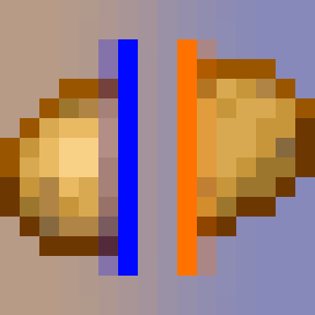

# Portal Cubed is being Rewritten!

 Due to this, this repository is now unused in favor of https://github.com/Fusion-Flux/Portal-Cubed-Rewrite and will not be recieving any updates.

If you ended up on this page looking for the most recent version/a playable build, the latest pre-rewrite (v2.3.0) release can be found [in our discord](https://discord.gg/YyrsVRNBA8).  

 **IT IS NOT RECOMMENDED TO USE THE VERSIONS IN THE RELEASES TAB** - These exist purely for archival reasons and to not break certain modpacks (such as BlanketCon 23) that pull from them.  They are more issue-prone and tend to have less compatibility with other common mods, so you will not receive any support if you use them.

 

 

 
-------------------------
# Portal Cubed

  

  
   
  
  

Portal Cubed is a Minecraft mod for Quilt that adds mechanics from Valve's Portal series.

## Implemented Features

- Various building blocks from areas across the series.  Build chambers themed around Portal 1, Portal 2, Old Aperture, and more!
- Physics props, including cubes, personality cores, radios, and other junk found around Aperture Science.
- The Aperture Science Handheld Portal Device, for all your spacetime traversal needs.
- Everyone's favorite foot-based suit of armor, the Long Fall Boots.
- Many of Aperture's most well known testing elements, including but not limited to:
  - Thermal Discouragement Beams
  - Hard Light Bridges
  - Material Emancipation Grids
  - Excursion Funnels
  - Gels
  - Aerial Faith Plates
  - High Energy Pellets
- The revival of some scrapped content, such as the cut Adhesion and Reflection gels.
- A handful of testing elements from Community-Made maps and mods, such as the Paint Gun.

## License
This project is licensed under the [MIT](LICENSE)

## Discord Server
Join my Discord server to talk about ClusterFlux mods, or if you need help with said mods!

## Support me!
You can directly support me on Ko-Fi!

